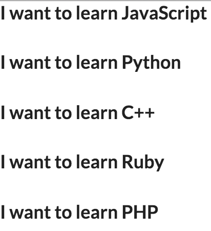
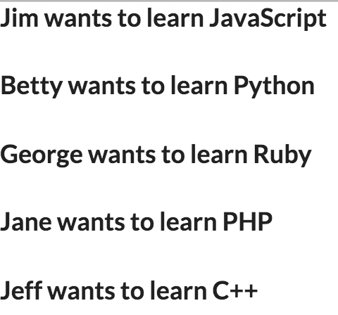

## Multiple Components and Properties
A few notes before beginning:
- If you want to see the results/experiement, go ahead and clone this repo:
```BASH
git clone https://github.com/jberry93/react-practice.git
```
- Navigate to the `componentsProperties` directory
- Install `live-server` using `npm install` or `npm install --save live-server`
- Initialize a development server using `npm start`
  - If this doesn't work then make sure your copy of `package.json` looks exactly like this:
  ```JSON
  {
    "name": "componentsproperties",
    "version": "1.0.0",
    "description": "",
    "main": "app.js",
    "scripts": {
      "test": "echo \"Error: no test specified\" && exit 1",
      "start": "live-server"
    },
    "author": "",
    "license": "ISC",
    "dependencies": {
      "live-server": "^0.9.0"
    }
  }
  ```
  - You need `"start": "live-server"` for `npm start` to work
- Should be good to go now :+1:

---
Here is the initial layout for our component:

```JavaScript
/* app.js */

var ComponentName = React.createClass({
  render: function() {
    return (
      <h3>I want to learn JavaScript</h3>
    );
  }
});

ReactDOM.render(<ComponentName />, document.getElementById("idOfDivElement"));
```

Here is the corresponding HTML file:

```HTML
<!DOCTYPE html>
<html>
  <head>
    <title>Components and Properties</title>
    <meta charset="utf-8">
    <script src="https://cdnjs.cloudflare.com/ajax/libs/react/0.14.3/react.js"></script>
    <script src="https://cdnjs.cloudflare.com/ajax/libs/react/0.14.3/react-dom.js"></script>
    <script src="https://cdnjs.cloudflare.com/ajax/libs/babel-core/5.8.23/browser.min.js"></script>
    <script type="text/babel" src="app.js"></script>
  </head>
  <body>
    <div id="idOfDivElement"></div>
  </body>
</html>
```
Output:


---
Let's use properties:

```JavaScript
/* app.js */

var ComponentName = React.createClass({
  render: function() {
    return (
      <h3>I want to learn {this.props.language}</h3>
    );
  }
});

ReactDOM.render(<ComponentName language="JavaScript" />, document.getElementById("idOfDivElement"));
```

In this case we use curly braces to refer to the value of property `language`

Output:


---
Let's add more components:

```JavaScript
/* app.js */

var ComponentName = React.createClass({
  render: function() {
    return (
      <h3>I want to learn {this.props.language}</h3>
    );
  }
});

ReactDOM.render(
  <div>
    <ComponentName language="JavaScript" />
    <ComponentName language="Python" />
    <ComponentName language="Ruby" />
    <ComponentName language="PHP" />
    <ComponentName language="C++" />
  </div>, document.getElementById("idOfDivElement"));
```
To include more than one component we need to place all our components in a div. Now we are reusing the same component and we are printing a different value each time since we are using curly braces to represent each value of property (`prop`) `language`

Output:



---
Now let's use multiple properties on multiple components:

```JavaScript
/* app.js */

var ComponentName = React.createClass({
  render: function() {
    return (
      <h3>{this.props.user} wants to learn {this.props.language}</h3>
    );
  }
});

ReactDOM.render(
  <div>
    <ComponentName user="Jim" language="JavaScript" />
    <ComponentName user="Betty" language="Python" />
    <ComponentName user="George" language="Ruby" />
    <ComponentName user="Jane" language="PHP" />
    <ComponentName user="Jeff" language="C++" />
  </div>, document.getElementById("idOfDivElement"));
```
Using the same concept as the previous section with one property, all we did was add an extra property referencing names

Output:


